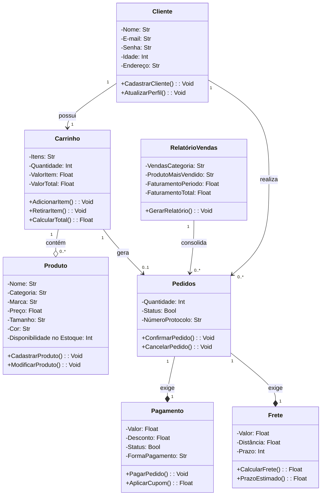

# Sistema-de-Loja-Virtual-Simplificada

## DESCRIÇÃO DO PROJETO:
- Desenvolvimento de um software simples para uma loja virtual com finalidade de obtenção de nota no trabalho da disciplina de PROGRAMAÇÃO ORIENTADA A OBJETOS do 2° semestre do curso de Engenharia de Software da Universidade Federal do Cariri (UFCA).

## OBJETIVOS: 
- Criação de um software simples funcional para um sistema de administração de uma loja virtual, sendo exigido alguns requisitos, como:
  Cadastro de Produtos e Clientes;
  Carrinho;
  Pedidos;
  Pagamentos;
  Cálculo de Frete;
  Relatório de Vendas.
  Contendo também, de forma obrigatória, um método de salvamento de dados implementado no software, como um arquivo JSON ou SQLite.

## ESTRUTURA PLANEJADA DE CLASSES:
- Classe: **Cliente**
  - Atributos:
    - Nome
    - E-mail
    - Senha
    - Idade
    - Endereço
 
  - Métodos:
    - CadatrarCliente()
    - AtualizarPefil()

- Classe: **Produto**
    - Atributos:
      - Nome
      - Categoria
      - Marca (Opcional)
      - Preço
      - Tamanho (Opcional)
      - Cor
      - Disponibilidade no Estoque
 
  - Métodos:
    - CadastrarProduto()
    - ModificarProduto()
 
- Classe: **Carrinho**
  - Atributos:
    - Itens
    - Quantidade de itens adicionados
    - Valor por item
    - Valor total dos itens adicionados no carrinho

  - Métodos:
    - AdicionarItem()
    - RetirarItem()
    - CalcularTotal()
 
- Classe: **Pedidos**
  - Atributos:
    - Quantidade
    - Status
    - Número de Protocolo

  - Métodos:
    - ConfirmarPedido()
    - CancelarPedido()

- Classe: **Pagamento**
  - Atributos:
    - Valor
    - Desconto
    - Status
    - Forma de Pagamento

  - Métodos:
    - PagarPedido()
    - AplicarCumpom()
    - ConfirmarEndereço()
 
- Classe: **Frete**
  - Atributos:
    - Valor
    - Distância
    - Prazo
 
  - Métodos:
    - CalcularFrete()
    - PrazoEstimado()

- Classe: **Relatório de Vendas**
  - Atributos:
    - Vendas por Categoria:
    - Produto mais Vendido:
    - Faturamento por Período:
    - Faturamento Total:
   
  - Métodos:
    - GerarRelatorio()
    
## UML TEXTUAL:
-----------
### Cliente
-----------
Atributos: 
  - Nome: str
  - E-mail: str
  - Senha: str
  - Idade: int
  - Endereço: str

Métodos:
  - CadatrarCliente(nome: str, email: str, senha: str, idade: int, endereco: str): void
  - AtualizarPefil(nome: str = None, email: str = None, senha: str = None, idade: int = None, endereco: str = None): void
-------------------------------------------------------------------------------------------------------------------------

### Produto
-----------
Atributos:
  - Nome: str
  - Categoria: str
  - Marca (Opcional): str
  - Preço: float
  - Tamanho (Opcional): str
  - Cor: str
  - Disponibilidade no Estoque: int

Métodos:
  - CadastrarProduto(nome: str, categoria: str, preco: float, tamanho: str [0..1], cor: str [0..1], disponibilidade: int): void
  - ModificarProduto(nome: str = None, categoria: str = None, preco: float = None, tamanho: str [0..1], cor: str [0..1], disponibilidade: int = None): void
-----------------------------------------------------------------------------------------------------------------------------------------------------------

### Carrinho
------------
Atributos:
  - Itens: str
  - Quantidade de itens adicionados: int
  - Valor por item: float
  - Valor total dos itens adicionados no carrinho: float

Métodos:
  - AdicionarItem(item: str, quantidade: int): void
  - RetirarItem(item: str, quantidade: int): void
  - CalcularTotal(quantidade: int, valor_item: floar, valor_total: float): float
--------------------------------------------------------------------------------

### Pedidos
------------
Atributos:
  - Quantidade: int
  - Status: bool
  - Número de Protocolo: str

Métodos:
  - ConfirmarPedido(status: bool): void
  - CancelarPedido(status: bool): void
---------------------------------------

### Pagamento:
--------------
Atributos:
  - Valor: float
  - Desconto: float
  - Valor do Frete: float
  - Status: bool
  - Forma de Pagamento: str

Métodos:
  - AplicarCumpom(desconto: float): float
  - PagarPedido(valor: float, desconto: float, frete: float): void
------------------------------------------------------------------

### Frete
---------
Atributos:
  - Valor: float
  - Distância baseada no endereço no remetente e do destinatário: float
  - Prazo de Entrega Estimado: str

Métodos:
  - CalcularFrete(valor: float, distancia: float): float
  - PrazoEstimado(prazo: float): float
------------------------------------------------------------------------

### Relatório de Vendas
-----------------------
Atributos:
  - Vendas por Categoria: str
  - Produto mais Vendido: str
  - Faturamento por Período: float
  - Faturamento Total: float

Métodos:
  - GerarRelatorio(vendas_categoria: str, produto_mais_vendido: str, faturamento_periodo: Float, faturamento_total: float): void
---------------------------------------------------------------------------------------
## DIAGRAMA DE CLASSES:
-----------------------

